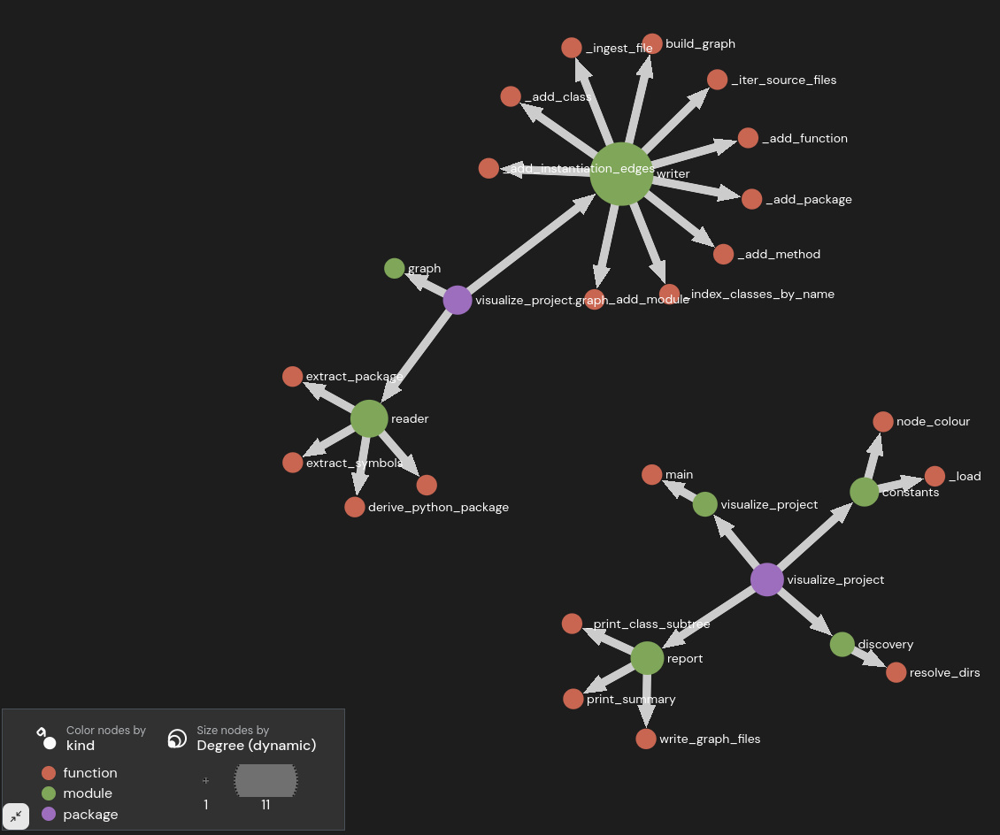

# Project graph tool

Simple python utility to produce [gexf](https://gexf.net/) and [graphml](https://en.wikipedia.org/wiki/GraphML) files.

Which can be displayed in [Gephi Lite](https://lite.gephi.org)




```sh
uvx --from git+ssh://git@github.com/Zerkath/project-graph-tool.git visualize-project
```
